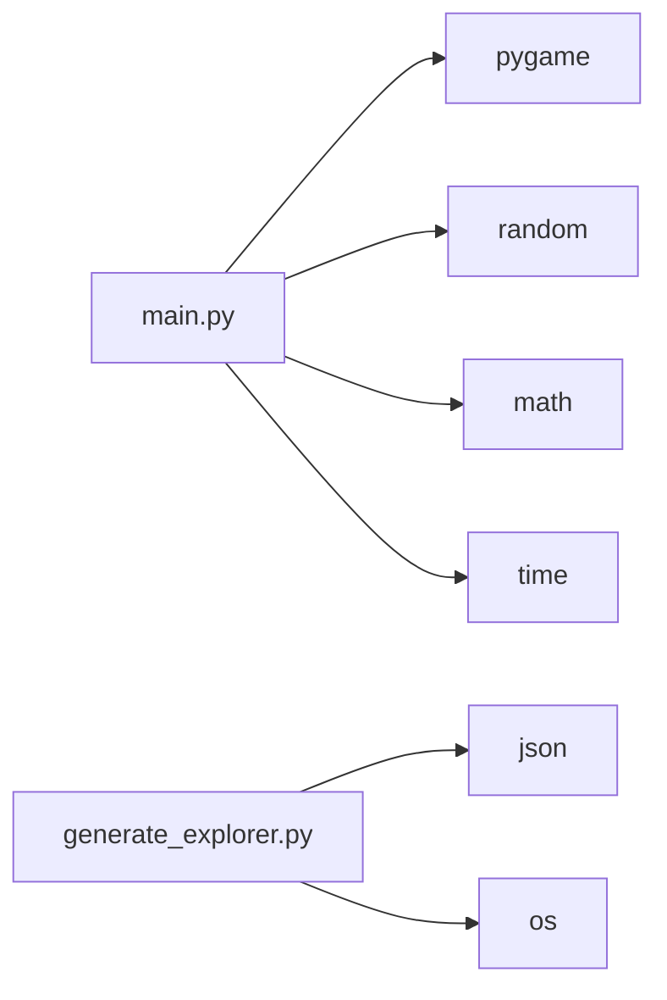
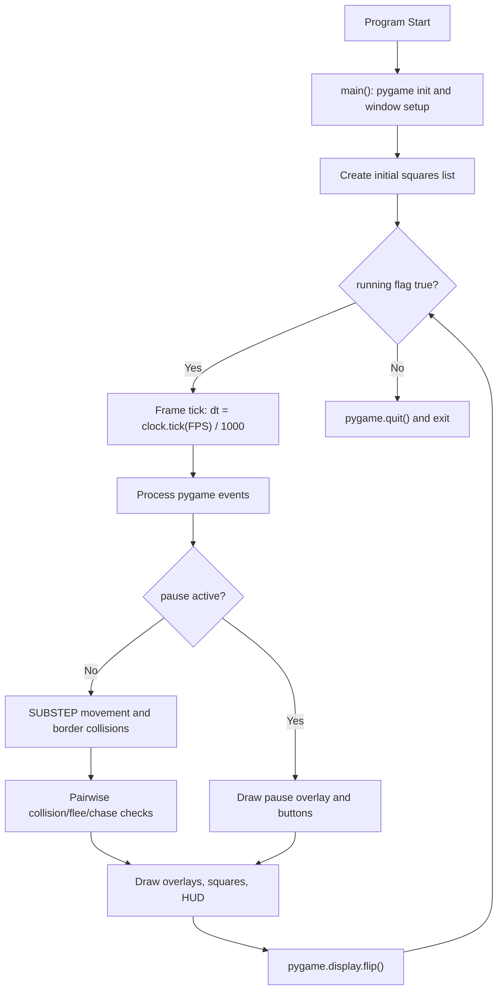
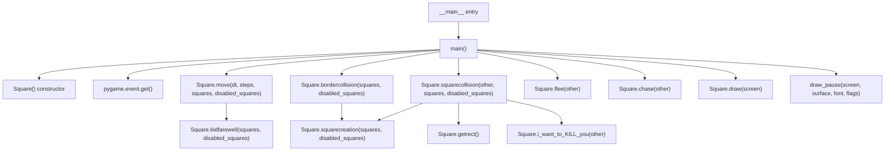
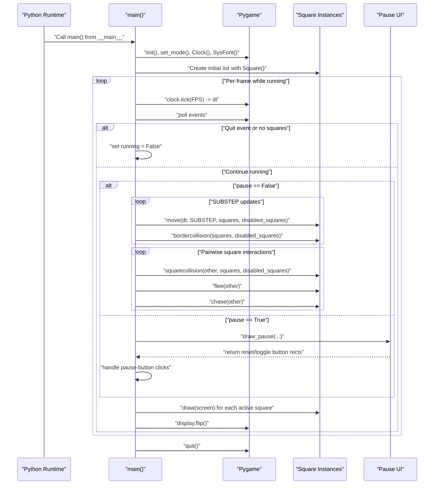
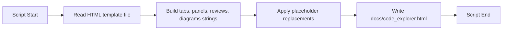

# Architecture Documentation

## Scope
This document describes the concrete architecture implemented in [main.py](main.py) and the documentation generator utility in [generate_explorer.py](generate_explorer.py).

## 1) Module Dependency Graph

Notes:
- The simulation runtime is centered in [main.py](main.py).
- The docs utility in [generate_explorer.py](generate_explorer.py) is separate from runtime execution.

## 2) High-Level Runtime Flow

Notes:
- The pause branch gates simulation updates while still rendering UI.
- The simulation can terminate when no active squares remain.

## 3) Function-Level Call Graph

Notes:
- Call edges reflect direct method/function invocations present in [main.py](main.py).
- [draw_pause](main.py#L314) is used only in paused rendering.

## 4) Primary Execution Sequence (Full Frame Path)

## 5) Utility Script Flow ([generate_explorer.py](generate_explorer.py))

Notes:
- This path is file-generation logic and does not participate in the Pygame runtime loop.
